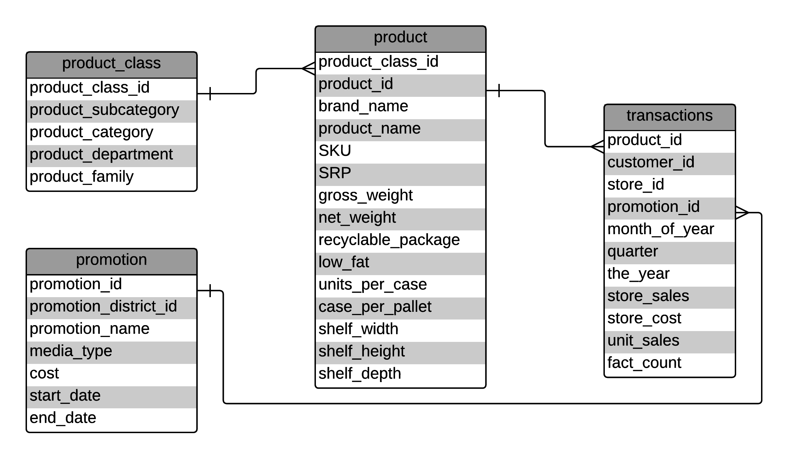

## Executive Summary

In 1997, this food mart generated the most of its profits from district 110 by selling a large variety of products. This food mart could take two strategies to increase sales and profitability in 1998, one on reward programs and one on smart promotion. The food mart could enroll more customers into its reward programs and reward its repeat customers to drive sales because repeat customers had been and would continue to be the source of profits. The food mart should not waste money on promotion districts other than 110 and should terminate those promotions with high cost per hit. This food mart could drive sales by promoting personalized rewards to its reward program members via direct mails, which integrates the two strategies together. 

## Data and Analysis Tool

This food mart data set records the products, promotions and sales of a food mart. This data set consists of four CSV tables: product, product_class, promotion and transactions. An Entity-Relationship (ER) diagram is reverse engineered from the four CSV files to provide a high-level view of this food mart data set. This ER diagram is constructed on [Lucidchart](www.lucidchart.com). 



Programming language R is used for this analysis. The CSV files are saved on a local desktop folder EtsyAnalystHomework/raw_data for import. 

```{r, message=FALSE, warning=FALSE}
setwd("~/Desktop/raw_data")
product_class <- read.csv("product_class.csv", quote="'")
product <- read.csv("product.csv", quote="'")
promotion <- read.csv("promotion.csv", quote="'")
transactions <- read.csv("transactions.csv", quote="'")
```

The following R packages are used for this analysis:

```{r, message=FALSE, warning=FALSE}
if (!require("sqldf")) install.packages('sqldf')
if (!require("treemap")) install.packages('treemap')
if (!require("googleVis")) install.packages('googleVis')
if (!require("wordcloud")) install.packages('wordcloud')
if (!require("tm")) install.packages('tm')
if (!require("DT")) install.packages('DT')
if (!require("ggplot2")) install.packages('ggplot2')
if (!require("DT")) install.packages('DT')
if (!require("reshape2")) install.packages('reshape2')
```

## The Food Mart in 1997

This food mart has `r sqldf("select count(distinct store_id) from transactions")` stores and 5581 of them are in promotion district 110. In 1997, totally `r sqldf("select count(distinct product_id) from transactions")` unique products were sold and stores in promotion district 110  generated the most revenue. Promotion district 110 should be the home field to this food mart. 

```{r}
datatable(sqldf("select a.promotion_district_id, a.number_of_stores, b.revenue from (select promotion_district_id, count(distinct store_id) number_of_stores from (select a.store_id, a.promotion_id, b.promotion_district_id from transactions as a left join promotion as b on a.promotion_id=b.promotion_id ) group by promotion_district_id) as a left join (select promotion_district_id, sum(store_sales) revenue from (select a.store_id, a.promotion_id,a.store_sales, b.promotion_district_id from transactions as a left join promotion as b on a.promotion_id=b.promotion_id ) group by promotion_district_id) as b on a.promotion_district_id=b.promotion_district_id "))%>%
  formatRound(columns=c('revenue'), digits=3)
```

In 1997, Hermanos, High Top and Tell Tale were the top three best selling brands in the food mart, although there was no brand dominating the sales as the treemap below shows. 

```{r}
string<-"select a.*, b.brand_name, b.product_name, b.product_class_id, c.product_family,c.product_department, c.product_category from (select product_id, sum(unit_sales) as total_unit_sales, sum(store_sales*unit_sales) as total_store_sales from transactions group by product_id) as a left join product as b on a.product_id=b.product_id left join product_class as c on b.product_class_id=c.product_class_id;"
products_sold<-sqldf(string)
treemap(products_sold, index="brand_name", vSize="total_store_sales", type="index", title="Revenues from brands")
```

Vegetables, snack foods and dairy were the top three best selling product categorys in the food mart. 

```{r}
treemap(products_sold, index="product_category", vSize="total_store_sales", type="index", title="Revenues from product categories")
```

Looking back 1997, this food mart had stable transaction volume except a spike in December holiday season, which might be expected. 

```{r}
string<-"select sum(unit_sales) as total_unit_sales, month_of_year, sum(store_sales*unit_sales) as total_store_sales,  sum(store_cost*unit_sales) as total_store_cost from transactions group by month_of_year"
sales_season<-sqldf(string)
ggplot(data=sales_season, aes(x=month_of_year, y=total_store_sales)) +
    geom_line() +
    geom_point() + ylab("Total Sales")+xlab("Month of Year") +ylim(0,400000)+ggtitle("Total Sales by Month")
```

Of the `r sqldf("select count(distinct customer_id) from transactions")-1`  identifiable customers, `r table(sqldf("select customer_id, count(distinct store_id) as store_count from transactions group by customer_id")[-1,]$store_count)[1]+table(sqldf("select customer_id, count(distinct store_id) as store_count from transactions group by customer_id")[-1,]$store_count)[2]` shopped in only 1 or 2 stores. Therefore, location might play an important role in where customers buy foods. 

## Growth Strategy One
###Engage Customers Through Reward Programs

Brad Sugars wrote in [Entrepreneur magazine](http://www.entrepreneur.com/article/206410) that, “if there is one mantra you should adopt now and plan for in your business, it should be that repeat business equals profit.” Repeat business generates predictable cash flow and saves resources (money & time) from the business acquisition. This food mart should leverage and invest in its repeat customers to increase sales and profitability. Reward programs could help this food mart engage more with its repeat customers.  

####Does this food mart have repeat customers? 
```{r}
#create a customer table with transactions and promotion
customer<-sqldf("select t.customer_id, t.store_id, t.store_sales, t.store_cost, t.unit_sales, p.promotion_district_id, p.media_type from transactions as t left join promotion as p on t.promotion_id=p.promotion_id") 

#create a histogram of customers' number of transactions
qplot(customer[which(customer$customer_id>0),]$customer_id, geom="histogram",main="Transaction Frequency by Customers",xlab="Customer ID",ylab="Frequency",binwidth=60) 
```

This food mart had customers who shop more than others regarding the total number of transactions. The peaks in this histogram highlight repeat customers.

```{r}
#create a table of number of months customers visit this food mart
datatable(sqldf("select months,count(months) as number_of_customers from (select customer_id, count(distinct month_of_year) as months from transactions group by customer_id) group by months"))
```

The table above provides counts of customers who visit this food mart for a certain number of months. There were eight customers(excluding the non-identifiable customers) who visited this food mart very month in 1997. Therefore, we can claim this food mart has two groups of customers: repeat customers and passive customers.

#### What is the impact of repeat customers?
```{r}
#identify those who make the top 20% quntiles of transaction volumes as top customers.  
freqshoper<-sqldf("select customer_id, count(customer_id) as frequence, sum(store_sales*unit_sales) as total_store_sales,  sum(store_cost*unit_sales) as total_store_cost from customer group by customer_id")[-1,]
freqshoper$isfreq<-ifelse(freqshoper$frequence>quantile(freqshoper$frequence,0.8),1,0)
datatable(sqldf("select isfreq as frequent_shoper,sum(total_store_sales) as total_store_sales, sum(total_store_cost) as total_store_cost, sum(total_store_sales)-sum(total_store_cost) as total_store_revenue from freqshoper group by isfreq"))%>%
  formatRound(columns=c('total_store_sales',"total_store_cost","total_store_revenue"), digits=3)
```

Define the top 20% quantile of customers as repeat customers. We observe that top 20% quantile of customers account for 883765.5/(883765.5+539811.8) = 62% revenue. Therefore, repeat customers benefited this food mart tremendously. As repeat customers are vital to its success, this food mart should engage and grow repeat customers. 

####How to engage and grow repeat customers?
A better understanding of current situations can help food mart decide on what strategies to take to engage and grow its repeat customers.
```{r}
#find out the percentage of transactions from identifiable customer
length(customer[which(customer$customer_id>0),1])/length(customer[,1])
```
Jose Alvarez wrote in [Harvard Business Review](http://hbswk.hbs.edu/item/customer-loyalty-programs-that-work) that, "Successful retailers connect with customers via loyalty programs at three levels. The first is an introduction of sorts: the customer receives a generic reward for enrolling in the program." Enrolling more customers into reward programs provides a basis for repeat shoppers engagement. In 1997, there was only about 63% of transactions from known customers. The food mart could initiate or expand its reward programs to identify those unknown customers.

```{r}
#create a word cloud for promotion names
promotion$promotion_name<-as.character(promotion$promotion_name)
wordcloud(promotion$promotion_name)
```

Given the word cloud of the promotions,  this food mart's promotions emphasized cost saving. Cost saving appeals to all customers: repeat customers and passive customers. To engage and grow repeat customers, this food mart need to reward repeat customers to come back again and again. Using rewards to engage repeat customers is a great strategy. Jose Alvarez wrote in [Harvard Business Review](http://hbswk.hbs.edu/item/customer-loyalty-programs-that-work) that, "At the second level, the retailer contacts the customer directly, often via e-mail, to offer a reward more tailored to the customer's wants and needs." Creating personalized rewards can be accomplished by building analytical teams working on reward program data sets. Although email was not popular enough in 1997, personalized rewards could be delivered via mails. 

## Growth Strategy Two
### Cost Control by Smart Promotion

Jack Trout wrote in [Forbes](http://www.forbes.com/2007/05/17/jack-trout-marketing-oped-cx_jt_0518trout.html) that, “Advertising is what you do when you can’t go to see somebody personally.” Unable to interact with every customer, companies run promotions to reach out to mass population and hope to drive sales in the future. This food mart made an investment in promotions running in many channels: Sunday paper, radio, TV and so on. As promotions incur significant cost to this food mart, we need to understand better the cost-benefits of these promotions to promote smartly in 1998.

####Where did the promotions money go?
```{r}
datatable(sqldf("select a.*, b.profit from (select promotion_district_id, sum(cost) as promotion_cost from promotion group by promotion_district_id) as a left join (select promotion_district_id, sum(store_sales*unit_sales-store_cost*unit_sales) as profit from customer group by promotion_district_id) as b on a.promotion_district_id=b.promotion_district_id"))%>%
  formatRound(columns=c('profit'), digits=3)
```

By exploring the table above, we observe the food mart spent about the same amount of money on promotions in its promotion districts, however, district 110 generated a lot more profits compared to other districts, not to mention that many districts did not generate any sales. Given the disproportional profit creation from these promotion distriects, promotion spending should not be evenly distributed across disctricts. For those districts that generated far fewer profits than its promotion cost, the food mart should consider stop promotions in these districts. Magid and Leonard wrote in [Harvard Business Review](https://hbr.org/1990/05/getting-the-most-out-of-advertising-and-promotion) that, "When advertising cannot demonstrate that it is incrementally contributing to sales of an established product, cut it back to some lower maintenance level—perhaps even to zero."

####What were the unworthy promotions?
```{r}
#calculate cost per hit
hitcost<-sqldf("select a.promotion_id, p.cost, p.cost/hit as cost_per_hit, a.hit from
(select count(promotion_id) as hit , promotion_id from transactions group by promotion_id) as a left join promotion as p
on a.promotion_id=p.promotion_id;")
datatable(hitcost) %>%
  formatRound(columns=c('cost_per_hit'), digits=3)

#calculate the average profit of a transactions
sqldf("select (sum(store_sales*unit_sales)-sum(store_cost*unit_sales))/count(product_id) as average_profit from transactions") 
```

For a promotion, when it results in a transaction, we call it a hit. We can calculate its cost per hit by dividing total promotion cost by the total count of hits. Cost per hit can tell the actual cost of promotions. The table above provides the cost per hit for all the promotions. As the average profit from a transaction is about 13, we should consider closing the promotions that had cost per hit much higher than 13. For example, promotion 1706 was a three-day street handout promotion that cost 13,982 and only resulted in 57.69 sales; food mart should not do it again.

##Conclusion
This food mart was successfully serving more than five thousand customers in a local area and was making profits by selling more than a thouand different products in 1997. To achieve a bigger sucess, this food mart need to grow sales through reward its repeat customers and control cost by running promotions smarter. 